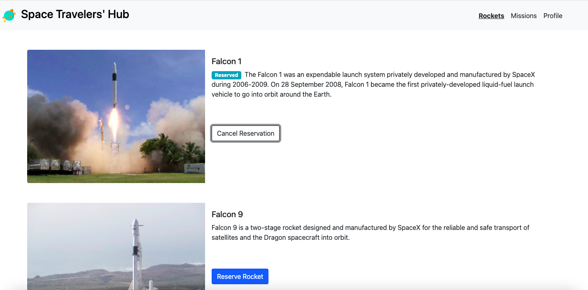

# Space Travelers' Hub

> The Space Travelers' Hub is a MVP version of it that allows you to:

- Book rockets
- Join selected space missions




## Live-version

[Live Version](https://github.com/afcastaneda223/space-travelers)

## Video Presentation

We did a short presentation of our project. You can view it here:

[Presentation](https://drive.google.com/file/d/1QSFY-dm2iCV575yfLcLLb0B5E3WbhQ_I/view?usp=sharing)

## Built With

- React + Javascript + Redux + Bootstrap

## Getting Started

* You will not need additional instructions on installing Prerequisites.
* In case you have node_modules on your folder Add them to .gitignore file before you a push.

### Prerequisites

* No prerequisites needed for this project.
 
### Installation
1. Clone the repo
   ```sh
   git clone git@github.com:afcastaneda223/math-magicians
   ```
2. Install NPM packages
   ```sh
   npm install
   ```
   2. Start the server 
   ```sh
   npm start
   ```


## Authors

👤 **Andres Felipe Castañeda Ramos**
- Github: [@afcastaneda223](https://github.com/afcastaneda223)
- Twitter: [@afcastaneda](https://twitter.com/afcastaneda)
- Linkedin: [Andres Felipe Castañeda](www.linkedin.com/in/andres-castaneda223)

👤 **Arturo Alvarez**
- Github: [@StarSheriff2](https://github.com/StarSheriff2)
- Twitter: [@ArturoAlvarezV](https://twitter.com/ArturoAlvarezV)
- Linkedin: [Arturo Alvarez](https://www.linkedin.com/in/arturoalvarezv/)


## 🤝 Contributing

Contributions, issues, and feature requests are welcome!

Feel free to check the [issues page](https://github.com/afcastaneda223/).


## 👋 Acknowledgements

My family

## Show your support

Give a ⭐️ if you like this project!
